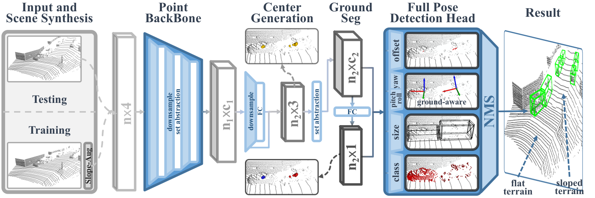
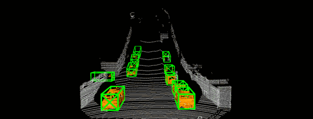
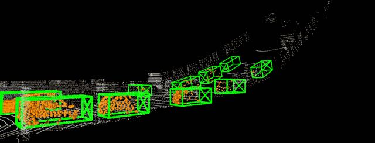
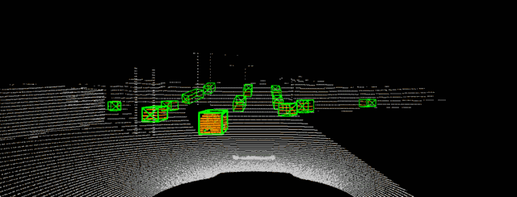
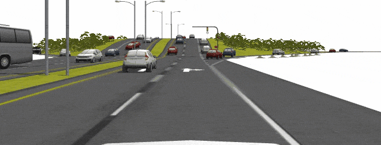
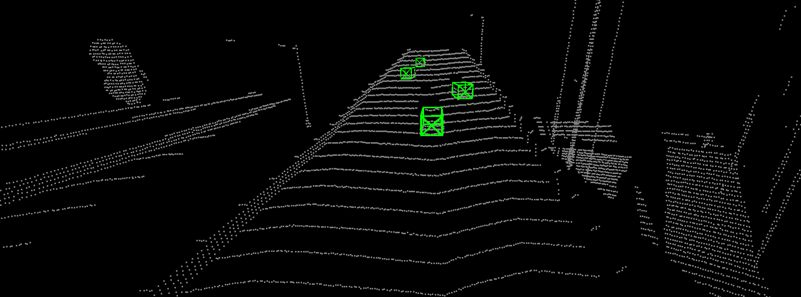
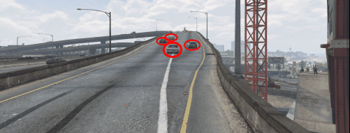

# Det6D: A Ground-Aware Full-Pose 3D Object Detector for Improving Terrain Robustness

[Junyuan Ouyang](https://github.com/OuyangJunyuan), [Haoyao Chen](https://github.com/HitszChen)

[**[project page]**](https://ouyangjunyuan.github.io/Det6D/) [**[arXiv]**](https://arxiv.org/abs/2207.09412) [**[video]**](https://youtu.be/VOQU78gdF9k)

This repo is the official code release of ***Det6D***, the first full-degree-of-freedom 3D detector.

## News:

* [2022/08/01]: Det6D is now on [arXiv](https://arxiv.org/abs/2207.09412), and code will be released after the paper is accepted. 
* [2022/06/28]: Add project page.

## Introduction

Accurate 3D object detection with LiDAR is critical for autonomous driving. Existing research is all based on the flat-world assumption. However, the actual road can be complex with steep sections, which breaks the premise. Current methods suffer from performance degradation in this case due to difficulty correctly detecting objects on sloped terrain. 

This work presents the first full-degree-of-freedom 3D object detector, ***Det6D***, without spatial and postural limitations to improve terrain robustness. We choose the point-based framework because of its flexible detection range. A ground-aware orientation branch leveraging the local ground constraints is designed to predict full-degree poses, i.e., including pitch and roll. Given the difficulty of long-tail non-flat scene data collection and 6D pose annotation, we present SlopeAug, a data augmentation method for synthesizing non-flat terrain from existing datasets recorded in flat scenes. Experiments on various datasets demonstrate the effectiveness and robustness of our method on different terrains. The proposed modules are plug-and-play for existing point-based frameworks.

## Preview

KITTI

| fontview | sideview |
| :-------------------------------------------------------: | :----------------------------------------------------------: |

GAZEBO

| results | scene |
| :----------------------------------------------------------: | :-------------------------------------------------------: |

GTA-V

| results | scene |
| :------------------------------------------------------: | :--------------------------------------------------: |
