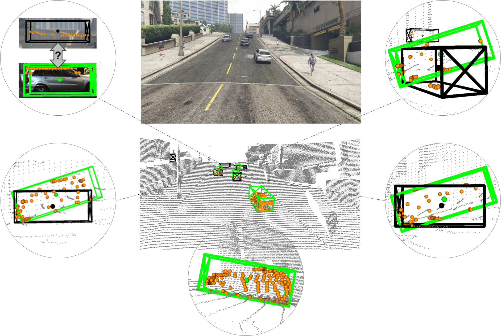
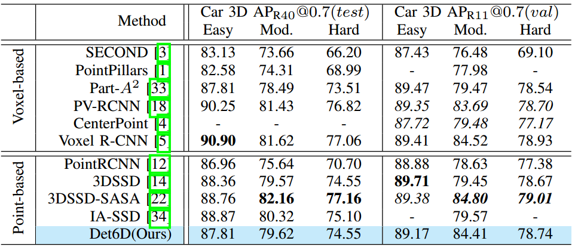
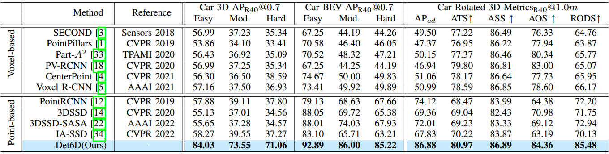
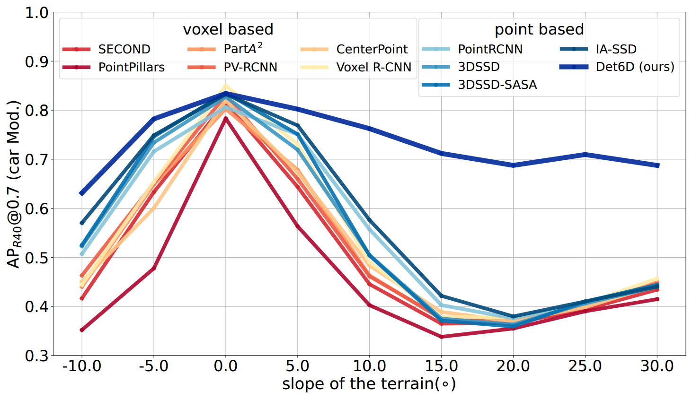
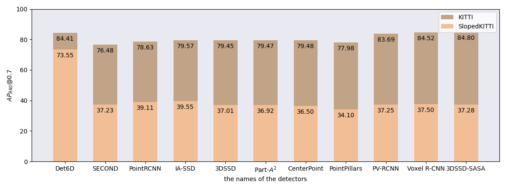
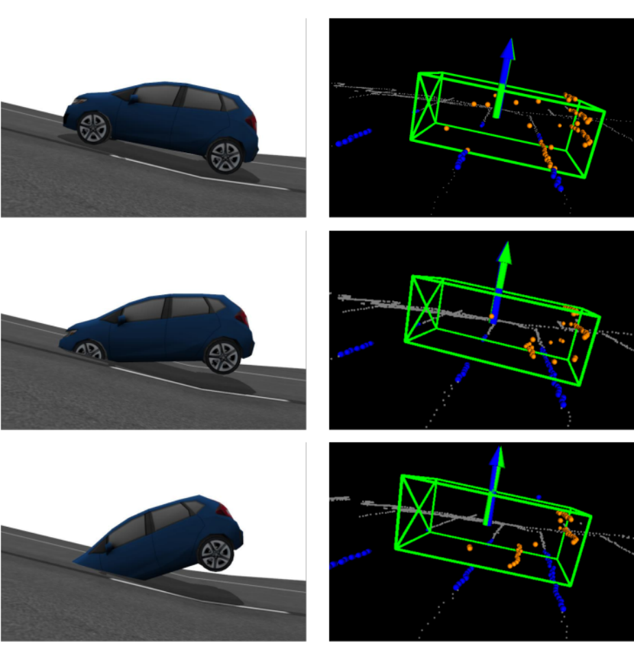
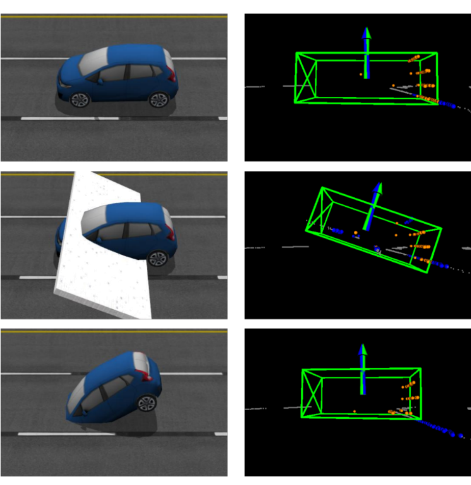
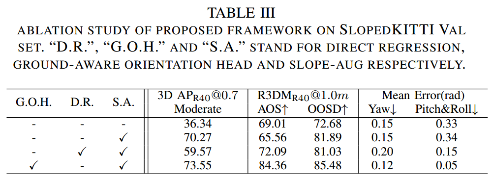

<p>
<div style="text-align: center;">
<a href="https://github.com/OuyangJunyuan">Junyuan Ouyang</a>&nbsp;&nbsp;&nbsp;&nbsp;&nbsp;
<a href="https://ieeexplore.ieee.org/author/37600762500">Haoyao Chen</a>
</div>
</p>

<p>
<center>Harbin Institute of Technology, Shenzhen</center>
<center>School of Mechanical and Electrical Engineering and Automation</center>
<div style="text-align:center">
<a href="https://nrs-lab.com/">

Networked RObotics and Systems Lab
</a>
 &nbsp;&nbsp;&nbsp;&nbsp;&nbsp;&nbsp;&nbsp;&nbsp;
</div>
</p>

<p>
<center><a href="https://arxiv.org/abs/2207.09412">[arXiv]</a>&nbsp;&nbsp;&nbsp;&nbsp;&nbsp;
<a href="https://github.com/OuyangJunyuan/Det6D">[Code]</a></center>
</p>

<br>

---
<br>
Det6D is a point-based one-stage detector to archive robust perception in complex terrains.
<br>
<br/>

<center>
results of <span style="color: black; ">previous</span> and <span style="color: green; ">ours</span>
</center>

<center>
<a href="img/cover.png">

</a>
</center>


---

## Abstract

Accurate 3D object detection with LiDAR is critical for autonomous driving. Existing research is all based on the flat-world assumption. However, the actual road can be complex with steep sections, which breaks the premise. Current methods suffer from performance degradation in this case due to difficulty correctly detecting objects on sloped terrain. 

This work presents the first full-degree-of-freedom 3D object detector, ***Det6D***, without spatial and postural limitations to improve terrain robustness. We choose the point-based framework because of its flexible detection range. A ground-aware orientation branch leveraging the local ground constraints is designed to predict full-degree poses, i.e., including pitch and roll. Given the difficulty of long-tail non-flat scene data collection and 6D pose annotation, we present SlopeAug, a data augmentation method for synthesizing non-flat terrain from existing datasets recorded in flat scenes. Experiments on various datasets demonstrate the effectiveness and robustness of our method on different terrains. The proposed modules are plug-and-play for existing point-based frameworks.<br>

<br>

---

## Method Overview

&nbsp;&nbsp;&nbsp;&nbsp; Det6D architecture overview ([more details](https://youtu.be/VOQU78gdF9k?t=45)):

* Slope-Aug, using to <strong><span style="color: orange; ">synthesis</span></strong> non-flat scenes with full-pose
  object annotation by taking full leverage of existing datasets.
* A point-based and anchor-free network structure for <strong><span style="color: orange; ">unlimited detection
  range</span></strong> (the object on slope have a high z-coord).
* Ground is <strong><span style="color: orange; ">a better constraint </span></strong>for the object located on it.
  Thus, a ground segmentation module is proposed to learn terrain knowledge.
* Full pose detection head contains a ground-aware orientation branch to predict object
  with <strong><span style="color: orange; ">full pose</span></strong>.

<center>
<a href="img/pipeline.png">

</a>
<br>
</center>


<br>

---

## Experiment Results

We extensive experiments to evaluate the effectiveness of our method.

### Flat Terrain

Quantitative comparison with several SOTA methods on the [KITTI](http://www.cvlibs.net/datasets/kitti/) dataset. Det6D
remain high performance in flat terrain.
<center>
<a href="img/kitti.png">

</a>
</center>

### Sloped Terrain

Quantitative comparison with several SOTA methods on the SlopedKITTI dataset (generate from original KITTI). Facing
sloped terrain, our method outperforms existing methods with remarkable margins.
<center>
<a href="img/slopedkitti.png">

</a>
</center>

### Influence of terrain

The slope of terrain greatly effects the detector performance.
<center>
<a href="img/ap_vs_slope.png">

</a>
</center>
The figure below shows the performance gap between flat and non-flat terrain (20°) for all detector. Our method
has <strong><span style="color: orange; ">minimal performance degradation</span></strong>.
<center>
<a href="img/performance_drop.png">

</a>
</center>

### What The Network Learned

It can be found by first column that the predicted pose do not change with the actual one. While it changes with the
local ground normal as shown in second column.
This experiment indicates Det6D leverage the knowledge of ground to predict the extra two poses, which is quite
different from yaw estimation.

<center>
<table align="center" width="100%">
    <td align="center">
        <a href="img/gz_on_slope.png">
        <br/>
        </a> a car on slope
    </td>
    <td align="center">
        <a href="img/gz_on_flat.png">
        <br/>
        </a> a car on flat
    </td>
</table>
</center>


### Ablation Study

The ablation study presents that the proposed Slope-Aug and ground-aware orientation branch are important for predicting
the actual full pose.
<center>
<a href="img/ablation.png">

</a>
</center>

<br>

---

## Results Visualization
For more details, please refer to our [video](https://youtu.be/VOQU78gdF9k?t=106). 

<center>

SlopdKITTI
<table align="center" width="100%">
    <td align="center">
        fontview
        <a href="img/slopedkitti.gif">
        
        </a> 
    </td>
    <td align="center">
        sideview
        <a href="img/slopedkitti_side.gif">
        
        </a>
    </td>
</table>
</center>


<center>
GAZEBO
<table align="center" width="100%">
    <td align="center">
        results
        <a href="img/gazebo_upslope_result.gif">
        
        </a> 
    </td>
    <td align="center">
        scene
        <a href="img/gazebo_upslope.gif">
        
        </a>
    </td>
</table>
</center>

<center>
GTA-V
<table align="center" width="100%">
    <td align="center">
        results
        <a href="img/gtav_points.gif">
        
        </a> 
    </td>
    <td align="center">
        scene
        <a href="img/gtav_imgs.gif ">
        
        </a>
    </td>
</table>
</center>

<br>

---

## Citation

If you can make use of this work, please cite:

```

```
