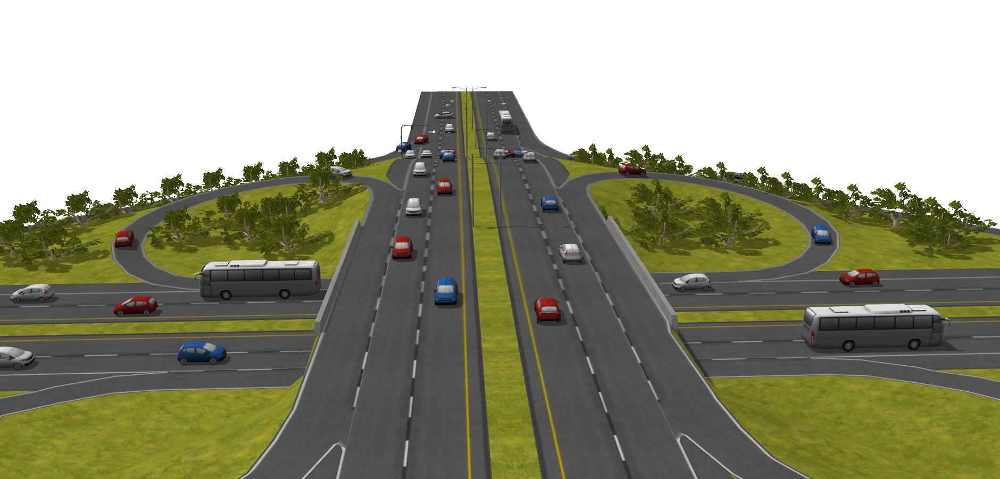
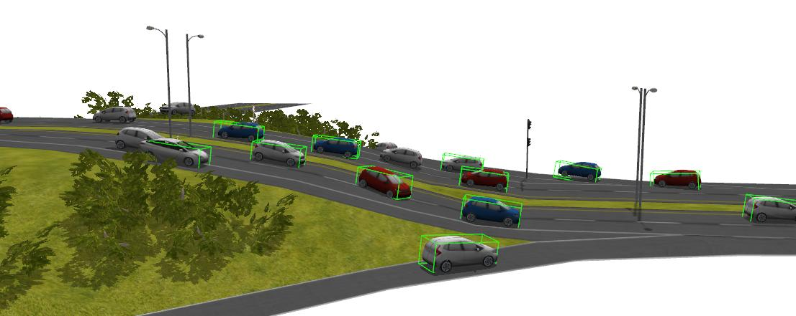
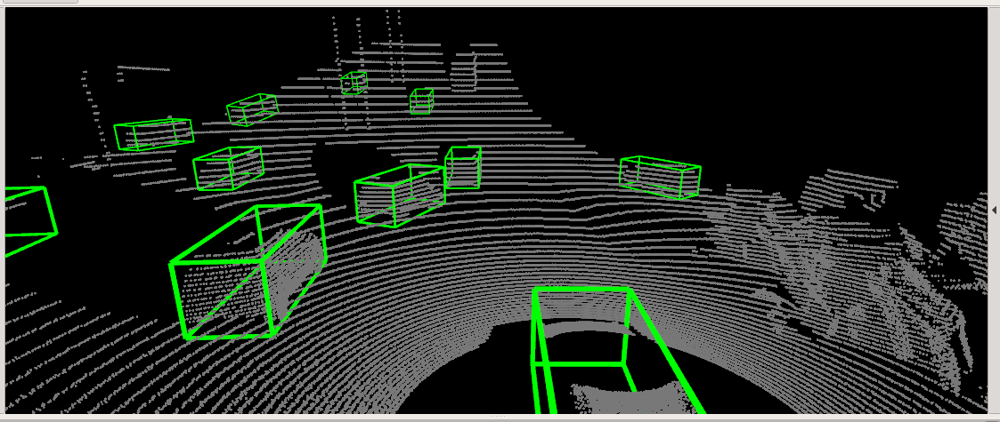
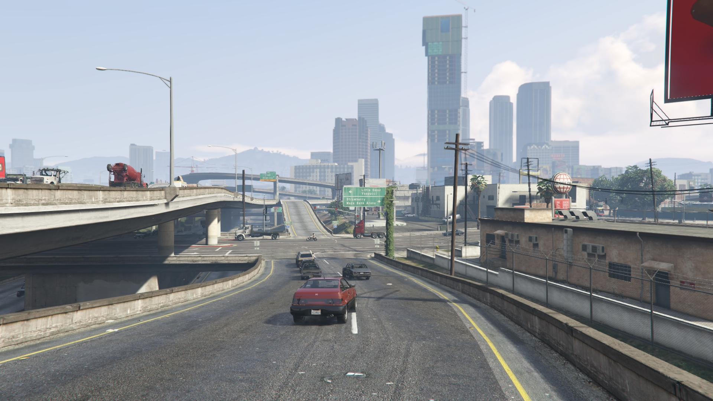

# Gazebo



​	Please make sure you have already installed the `ros` (robot operation system) and have all [gazebo default models](https://github.com/osrf/gazebo_models). 

* download map from [Google Drive](https://drive.google.com/drive/folders/1lHmnLXnrRubRj3xDqdY6z3fW5aqGFIQa?usp=sharing) and store it in [sim/gazebo/src/gazebo_simulation/robot_simulation/robot_gazebo/models](gazebo/src/gazebo_simulation/robot_simulation/robot_gazebo/models).

* build the ros workspace:`cd sim/gazebo && catkin_make`

* source the workspace: `source devel/setup.zsh` or `source devel/setup.bash`

* startup the simulation: `roslaunch robot_gazebo det6d_sim.launch`. then you can see the simulation of LiDAR in `rviz` .

* detect objects in gazebo: 

  ```bash
  python ./src/detection/script/detection.py --cfg_file ../../core/tools/cfgs/kitti_models/det6d_pitch_car.yaml --ckpt ../../core/tools/models/det6d_pitch_car_slopeaug01_80.pth --topic /prius_ego/
  hdl_32e           
  ```

  note: some dependencies should be installed before.  `pip install rospkg` and `sudo apt-get install ros-melodic-ros-numpy`

* display object bounding boxes in gazebo client 

  ```bash
  rosrun plugins gz_marker
  ```

  

  or `rviz`.

  

  

  

## GTA-V



This part of the simulation needs to be run on the `Windows` platform. we use the methods mention in [LiDAR-GTA-V](https://github.com/UsmanJafri/LiDAR-GTA-V) and [DeepGTAV-PreSIL](https://github.com/bradenhurl/DeepGTAV-PreSIL) to collect point cloud in game and detect objects offline via aforementioned approach.